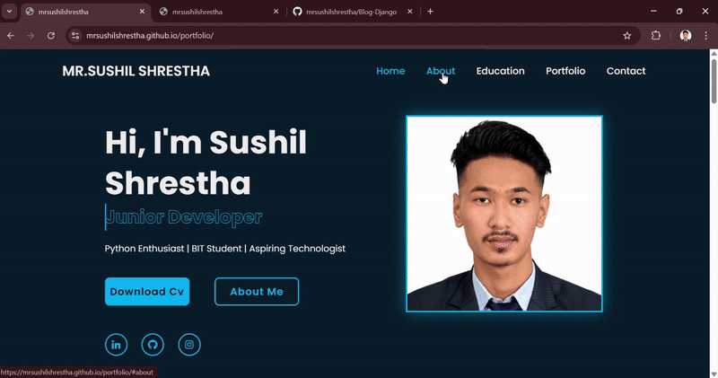
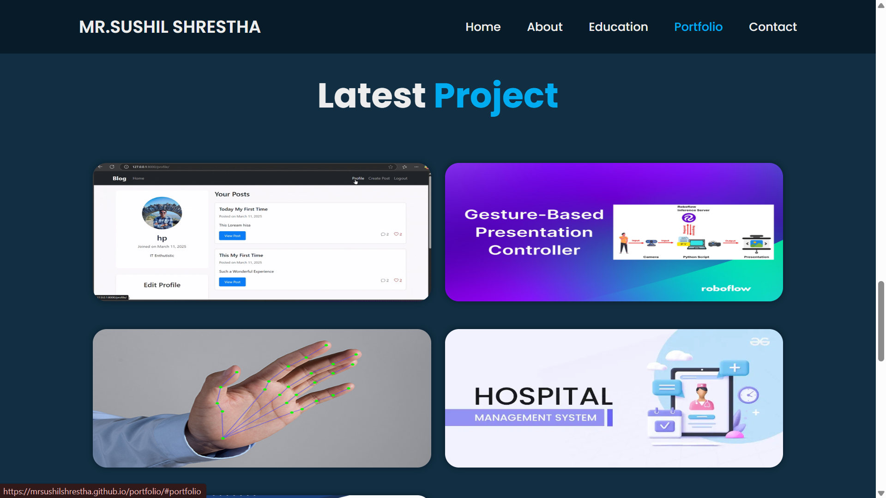

# Portfolio Website - Sushil Shrestha



## 🚀 About the Project
This is my personal **Portfolio Website**, showcasing my journey as a **Junior Developer** and **Python Enthusiast**. It includes sections about my education, skills, projects, and ways to connect with me. 

## 🌟 Features
- Responsive design for all devices 📱💻
- Interactive animations ✨
- Preloading for optimized performance ⚡
- Dynamic portfolio section 🛠️
- Contact form powered by EmailJS 📩

## 🏗️ Tech Stack
- **Frontend**: HTML, CSS, JavaScript
- **Icons**: BoxIcons
- **Email Service**: EmailJS
- **Fonts**: Google Fonts

## 📂 Project Structure
```
📦 portfolio
├── 📂 css
│   ├── style.css
├── 📂 js
│   ├── javascript.js
├── 📂 images
│   ├── avatar4.jpg
│   ├── avatar2.png
├── index.html
└── README.md
```

## 📸 Screenshots





## 🔥 Live Demo
[Check it out here](https://mrsushilshrestha.github.io/portfolio/)

## 🛠️ Setup Instructions
1. Clone this repository:
   ```sh
   git clone https://github.com/mrsushilshrestha/portfolio.git
   ```
2. Navigate to the project folder:
   ```sh
   cd portfolio
   ```
3. Open `index.html` in your browser.

## 📬 Contact Me
- **LinkedIn**: [mrsushilshresthaofficial](https://www.linkedin.com/in/mrsushilshresthaofficial/)
- **GitHub**: [mrsushilshrestha](https://github.com/mrsushilshrestha)
- **Instagram**: [@mrsushilshrestha](https://www.instagram.com/mrsushilshrestha/)

---
### 🚀 Created by **Sushil Shrestha**

## Bootstrap Integration

The portfolio website has been updated to use Bootstrap 5.3 (the latest version) while maintaining the original design and functionality. The following changes were made:

### Updates
- Added Bootstrap 5.3 CSS and JS CDN links
- Created a responsive grid layout using Bootstrap's container and row/column system
- Added responsive utility classes for better mobile experience
- Enhanced form controls with Bootstrap classes while keeping original styling
- Created a custom bootstrap-overrides.css file to ensure compatibility
- Added improved form validation to the contact form
- Added Bootstrap tooltips and popovers support (ready to use if needed)
- Maintained all original animations and visual effects

### Files Updated
- `index.html` - Added Bootstrap integration while preserving the original design
- `js/javascript.js` - Enhanced with Bootstrap JS support and improved form validation
- `css/bootstrap-overrides.css` - New file with custom styles to ensure compatibility

### Benefits
- More responsive layout across different screen sizes
- Improved maintainability with standard grid system
- Enhanced form validation and user experience
- Code is now more organized and follows modern web practices
- The site now benefits from Bootstrap's accessibility features

All original functionality and visual design elements have been preserved.

# Portfolio Website with Auto Gallery

This portfolio website includes an auto-gallery feature that automatically displays images from specific folders and generates captions based on the filenames.

## How to Add Images to the Gallery

1. **Folder Structure**:
   - Certificate images go in: `images/certificates/`
   - Personal images go in: `images/personal/`
   - Work images go in: `images/work/`
   - Event images go in: `images/events/`

2. **Naming Convention**:
   - Use descriptive names with underscores between words
   - Example: `hiking_trip.jpg`, `team_meeting.jpg`, `python_certificate.jpg`
   - The script will automatically convert these to proper captions:
     - `hiking_trip.jpg` → "Hiking Trip"
     - `team_meeting.jpg` → "Team Meeting"
     - `python_certificate.jpg` → "Python Certificate"

3. **Supported Image Types**:
   - JPG/JPEG
   - PNG
   - GIF
   - WebP

4. **Image Size Recommendations**:
   - Width: 800-1200px
   - Height: 600-900px
   - Aspect ratio: 4:3 or 16:9 works best
   - File size: Keep under 500KB for optimal loading

## How It Works

The `auto-gallery.js` script:
1. Looks for images in the designated folders
2. Creates gallery items with images and captions
3. Displays them in their respective sections
4. Provides modal view for full-size images when clicked

## Troubleshooting

If images aren't displaying:
1. Check that the image files are in the correct folders
2. Verify file permissions (should be readable)
3. Make sure filenames don't contain special characters
4. Check browser console for any JavaScript errors

